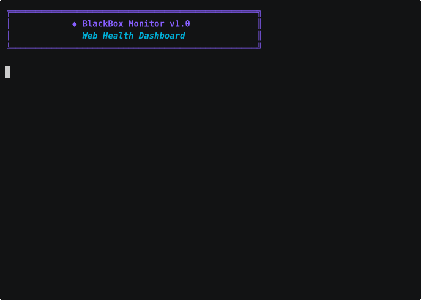
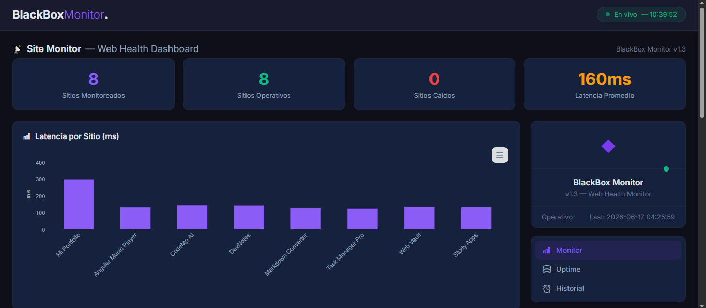

# BlackBox Monitor


[](https://goreportcard.com/report/github.com/marcelo-adan/blackbox-monitor)
[](https://github.com/marcelo-adan/blackbox-monitor/actions/workflows/ci.yml)

> Monitoreo de salud web con dashboard visual, almacenamiento y gráficas en tiempo real.



## Descripcion

**BlackBox Monitor** es un sistema de monitoreo de sitios web con interfaz en terminal y dashboard web. Verifica el estado HTTP de tus URLs, mide latencia, y te muestra resultados en tiempo real via terminal con estilos Lip Gloss o via navegador con gráficas ApexCharts.

Ideal para desarrolladores que quieren monitorear sus deployes (Vercel, Render, GitHub Pages, etc.) desde una sola herramienta.

## Caracteristicas

| Caracteristica | Estado |
|---|---|
| Verificacion HTTP con status code | Hecho |
| Interfaz terminal con colores (Lip Gloss) | Hecho |
| Medicion de latencia en ms | Hecho |
| Configuracion via YAML | Hecho |
| Multiples URLs (8 sitios configurados) | Hecho |
| Monitoreo continuo con intervalo configurable | Hecho |
| Graceful shutdown (Ctrl+C limpio) | Hecho |
| Dashboard web (CSS Grid + ApexCharts) | Hecho |
| Endpoint API /api/status (JSON) | Hecho |
| Flag -config, -interval, -port | Hecho |
| Logs en SQLite (build tag opcional) | Hecho |
| Alertas por Telegram | Hecho |
| Notificación inicio Telegram | Hecho |
| SSL cert expiry check | Hecho |
| Healthcheck endpoint (/health) | Hecho |
| Export CSV (/api/export) | Hecho |
| Dashboard oscuro moderno | Hecho |
| Pruebas unitarias | Hecho |

## Stack tecnologico

| Componente | Tecnologia | Proposito |
|---|---|---|
| Lenguaje | Go 1.22 | Binario unico, stdlib completa |
| UI Terminal | `charmbracelet/lipgloss v1.1.0` | Estilos modernos en terminal |
| Dashboard Web | CSS Grid + ApexCharts | Panel visual en navegador |
| Configuracion | `gopkg.in/yaml.v3` | Config YAML flexible |
| Almacenamiento | `mattn/go-sqlite3` (opcional) | Historial de checks |
| Embed | `embed` (stdlib) | Embeber HTML/CSS/JS en binario |

## Instalacion

### Prerequisitos
- Go 1.22 o superior

### Compilar y ejecutar

```bash
cd blackbox-monitor

# Compilar
go build -o bin/blackbox-monitor .

# Ejecutar (terminal + dashboard web en :8080)
./bin/blackbox-monitor

# Sin dashboard web
./bin/blackbox-monitor -port ""

# Con intervalo personalizado (cada 10 segundos)
./bin/blackbox-monitor -interval 10

# Con config personalizado
./bin/blackbox-monitor -config mi-config.yaml
```

### Directamente con Go

```bash
go run . -port :8080 -interval 60
```

### Abrir el dashboard

```
http://localhost:8080
```

El dashboard se actualiza automaticamente cada 10 segundos.

## Configuracion

1. Copia el archivo de ejemplo:
   ```bash
   cp config.example.yaml config.yaml
   ```
2. Edita `config.yaml` con tus sitios y credenciales de Telegram (opcional):

```yaml
interval: 60

# Opcional: alertas por Telegram ante cambios de estado
telegram:
  enabled: false
  bot_token: "YOUR_BOT_TOKEN_HERE"
  chat_id: "YOUR_CHAT_ID_HERE"

sites:
  - name: "Mi Portfolio"
    url: "https://tu-sitio.vercel.app"
    timeout: 5000
  - name: "Mi Blog"
    url: "https://tu-blog.vercel.app"
    timeout: 10000
```

### Flags disponibles

| Flag | Default | Descripcion |
|---|---|---|
| `-config` | `config.yaml` | Ruta del archivo de configuracion |
| `-interval` | valor del config | Intervalo en segundos entre chequeos |
| `-port` | `:8080` | Puerto del dashboard web (vacio = desactivado) |

### Sitios de ejemplo

```yaml
sites:
  - name: "Example Site"
    url: "https://example.com"
    timeout: 5000
  - name: "Wikipedia"
    url: "https://www.wikipedia.org"
    timeout: 5000
  - name: "GitHub"
    url: "https://github.com"
    timeout: 5000
```

## Estructura del proyecto

```
blackbox-monitor/
├── main.go                 # Entry point, flags, loop, señales
├── server.go               # Servidor HTTP + endpoints (/api/status, /health, /api/export)
├── state.go                # Estado compartido thread-safe
├── storage_entry.go        # Interfaz Store + tipos
├── storage_sqlite.go       # Implementacion SQLite (build tag: sqlite)
├── storage_nosqlite.go     # Implementacion sin-op (build tag: !sqlite)
├── go.mod / go.sum         # Dependencias
├── config.yaml             # Configuracion de sitios (ignorado por git)
├── config.example.yaml     # Ejemplo de configuracion
├── screenshots/            # Capturas y GIF demo
│   ├── demo.gif
│   └── dashboard.png
├── bin/                    # Ejecutable compilado
├── internal/
│   ├── monitor/
│   │   └── checker.go      # CheckSite() + extraccion SSL
│   ├── notifier/
│   │   └── telegram.go     # Alertas Telegram (cambio estado + startup)
│   ├── storage/
│   │   └── sqlite.go       # SQLite storage (build tag: sqlite)
│   └── ui/
│       └── styles.go       # Estilos Lip Gloss (terminal)
└── web/
    └── static/
        ├── index.html      # Dashboard oscuro (CSS Grid + ApexCharts)
        └── plugins/        # Themify icons
```

## Alertas por Telegram

Puedes recibir notificaciones en tu telefono cuando un sitio cambie de estado (Online ↔ Offline).

### Configuracion

1. **Crear un bot en Telegram:**
   - Abre Telegram y busca [@BotFather](https://t.me/botfather).
   - Envia `/newbot` y sigue las instrucciones.
   - Copia el `bot_token` que te proporciona.

2. **Obtener tu chat_id:**
   - Envia un mensaje a tu nuevo bot: `/start`.
   - Abre en tu navegador: `https://api.telegram.org/bot<TU_TOKEN>/getUpdates`
   - Busca el campo `chat` → `id` en la respuesta JSON.
   - Copia ese numero (es tu `chat_id`).

3. **Editar `config.yaml`:**

   ```yaml
   telegram:
     enabled: true
     bot_token: "123456:ABC-DEF1234ghIkl-zyx57W2v1u123ew11"
     chat_id: "123456789"
   ```

4. **Ejecutar normalmente.** Las alertas se enviaran automaticamente cuando un sitio cambie de estado.

**Nota:** Si `enabled: false` o las credenciales estan vacias, el monitor funciona sin alertas. Las notificaciones se envian en segundo plano sin ralentizar el monitoreo.

## Dashboard Web



El dashboard web es una interfaz moderna en modo oscuro con CSS Grid:

- **4 tarjetas de resumen:** Total, Online, Offline, Latencia promedio
- **Grafica de barras:** Latencia por sitio (ApexCharts)
- **Grafica donut:** Proporcion online vs offline
- **Tabla historial:** Ultimo chequeo de cada sitio con colores, codigo HTTP y estado SSL
- **Sidebar:** Info del monitor, estado global, uptime, navegacion
- **Auto-refresh:** Cada 10 segundos via AJAX a /api/status
- **Responsive:** Funciona en desktop y mobile
- **Export CSV:** Boton para descargar historial de chequeos

### API endpoint

```
GET /api/status
```

Respuesta JSON:
```json
{
  "sites": [...],
  "online": 8,
  "total": 8,
  "percent": 100,
  "avg_latency": 195,
  "last_check": "2026-06-16 18:11:46",
  "total_checks": 8,
  "total_failures": 0
}
```

## Comandos utiles

```bash
# Compilar
go build -o bin/blackbox-monitor .

# Verificar codigo
go vet ./...

# Ejecutar con dashboard
go run . -port :8080

# Ejecutar sin dashboard (solo terminal)
go run . -port ""

# Con SQLite (requiere gcc)
go build -tags sqlite -o bin/blackbox-monitor .

# Limpiar terminal antes de cada ciclo (automatico con loop)
# La app limpio la pantalla automaticamente en cada ciclo
```

## Tests

```bash
# Ejecutar todos los tests
go test ./... -v

# Con detector de race conditions
go test -race ./...

# Ver cobertura
go test ./... -cover
```

## Roadmap

- [x] Verificacion HTTP con status code y latencia
- [x] Interfaz terminal con Lip Gloss (colores, bordes, boxes)
- [x] Multiples URLs en config.yaml
- [x] Loop de monitoreo continuo con time.Ticker
- [x] Graceful shutdown con SIGINT/SIGTERM
- [x] Flags -config, -interval, -port
- [x] Dashboard web oscuro con CSS Grid + ApexCharts
- [x] Endpoint /api/status (JSON)
- [x] Embebed de archivos estaticos con embed
- [x] SQLite storage con build tag
- [x] Sitios configurables via YAML (ejemplos públicos incluidos)
- [x] Alertas por Telegram (configurables via YAML, goroutine no bloqueante)
- [x] Notificación de inicio por Telegram
- [x] Tests unitarios (checker, server, notifier)
- [x] SSL cert expiry check
- [x] Healthcheck endpoint (`GET /health`)
- [x] Export CSV (`GET /api/export`)
- [x] Dashboard web oscuro moderno (sin Bootstrap)

### Proximas features (v1.4+)

| # | Feature | Descripcion | Prioridad |
|---|---|---|---|
| 1 | Intervalo configurable desde dashboard | Boton en el dashboard web para cambiar el intervalo de monitoreo en tiempo real. | Baja |
| 2 | Uptime history chart | Gráfico histórico de uptime en el dashboard usando datos de SQLite. | Media |
| 3 | Soporte para múltiples canales de notificación | Webhooks, email, Slack además de Telegram. | Baja |

## Licencia

Distribuido bajo licencia MIT. Ver [LICENSE](LICENSE) para mas informacion.

## Autor

- **Marcelo Adan** - [GitHub](https://github.com/marcelo-adan)
- **Portfolio** - [marcelo-palma-portfolio.vercel.app](https://marcelo-palma-portfolio.vercel.app)
